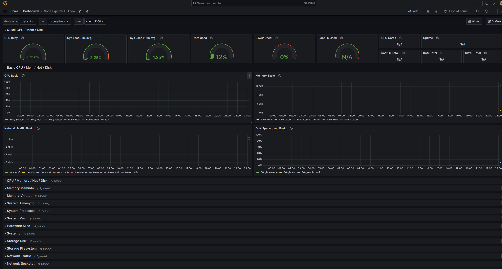

# About  
Use tools and technologies to create an infrastructure for a webservice.
# Project folder structure
├── app   
│&emsp;&emsp;├── Dockerfile  
│&emsp;&emsp;└── docker-compose.yml  
├── infrastructure  
│&emsp;&emsp;├── ansible  
│&emsp;&emsp;│&emsp;&emsp;├── config-jenkins-instance.yaml  
│&emsp;&emsp;│&emsp;&emsp;└── config-new-ec2-instance.yaml  
│&emsp;&emsp;├─── terraform   
│&emsp;&emsp;│&emsp;&emsp;├── main.tf  
│&emsp;&emsp;│&emsp;&emsp;└── development-terraform.example.tfvars  
├── Jenkinsfile  
# Tools, other technologies used in this project
- **Docker**  
    - Build a Docker image for the Laravel web application.  
    - Run a Docker container using the image from above on an AWS EC2 instance to serve requests.  

- **AWS**  
    - EC2: For a webservice using a Docker container to handle requests and a Jenkins server  
    - S3: For storing db exported files  
    - RDS: For a database  

- **Jenkins**  
    - To provide CI/CD for the web app  

- **Terraform**  
    - To create an infrastructure which includes 2 aws ec2 instances (1 for web app, 1 for Jenkins)
    - Trigger Ansible to config the infrastructure when the infrastructure is created  

- **Ansible**  
    Config the infrastructure from Terraform, the steps are:  
    ## For **web app** instance:  
    - Install Docker  
    - Add user to Docker's group  
    - Pull Docker image (https://hub.docker.com/repository/docker/daipham99/learning) and uses it to run a Docker container  

    ## For **Jenkins** instance:  
    - Install Jenkins  
    - Install Docker  
    - Install AWS CLI
    - Add user to Docker's group   

# The Infrastructure flow  
- Create the infrastructure using Terraform
- An AWS EC2 instance gets created by Terraform
- Terraform triggers Ansible after creating the infrastructure successfully
- Ansible runs a playbook 
- The AWS EC2 instance is now fully configured by Ansible and ready to serve requests

# The Jenkins flow  
- Check environment state of the instance and check if its able to SSH to the web app instance
- Get the correct .env file based on the branch which is triggering the build
- Build the image and run 
- Run some tests (Will update this stage soon)
- Tag and push Docker image to a repo, currently I'm using Docker Hub
- Finally, SSH to the web app instance to make it to use to most recent Docker image.

# Demo

- Jenkins  

- Infrastructure as Code  
 

- Prometheus & Grafana  

# For demand for testing
<ins>Please be noticed that since i'm using AWS services at free tier level so i will mostly need to turn it off for financial purposes. 
    The IP of the instances are not static since it will get changed everytime i turn it back on, if you can't connect through the IPs means the instances are offline or they're online but the IPs have been changed.    
    In case of demands, please feel free to contact on Facebook (https://www.facebook.com/kobiet.tuikobiet/).  
</ins>
## Web app  
- Ip address: 13.250.101.14

## Jenkins  
- Ip address: 175.41.157.142/8080
- Account: guess/guess

