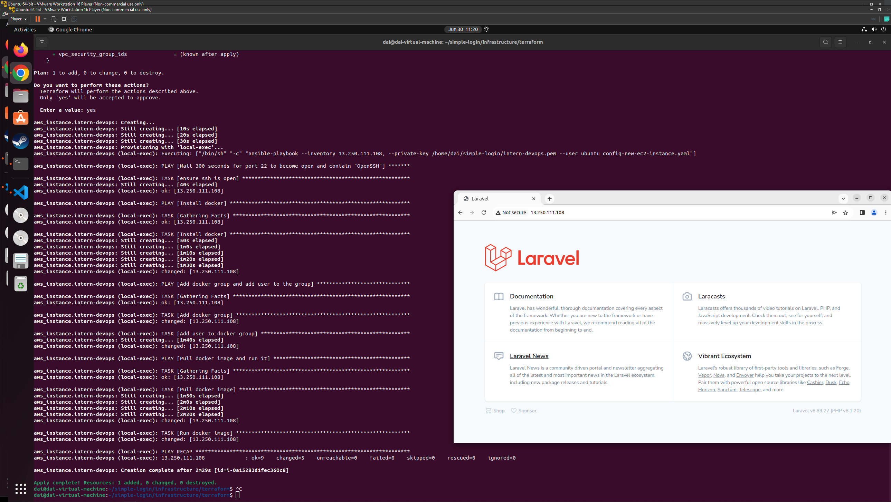

# About  
Use tools and technologies to create an infrastructure for a webservice.
## Tools, other technologies used in this project
- **Docker**  
    Build a Docker image for the Laravel web application.  
    Run a Docker container using the image from above on an AWS EC2 instance to serve requests.  
- **AWS**  
    EC2: For a webservice using a Docker container to handle requests  
    S3: For storing db exported files 
    RDS: For a database  
- **Terraform**  
    To create the infrastructure  
    Trigger Ansible to config the infrastructure when the infrastructure is created  
- **Ansible**  
    Config the infrastructure from Terraform, the steps are:  
    - Install Docker  
    - Add user to Docker's group  
    - Pull Docker image (daipham99/learning:0.2) and uses it to run a Docker container  

## The main flow  
- Create the infrastructure using Terraform
- An AWS EC2 instance gets created by Terraform
- Terraform triggers Ansible after creating the infrastructure successfully
- Ansible runs a playbook 
- The AWS EC2 instance is now fully configured by Ansible and ready to serve requests
